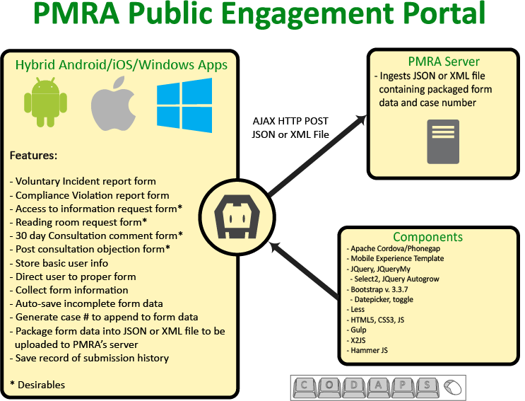

# PEP Companion App
#### MAD9145 - Applied Project, CODAPS

Cody Armstrong, Daniel Cormier, Paul Coyte, Alex King, Owen Sheehan, Shannon Wilson

The purpose of this document is to summarize deployment information regarding the PEP Companion App. It will include information such as a deployment diagram, iOS and Android installation, hardware and software requirements and any outstanding issues the app may have. 

#### Deployment Diagram

#### Hardware Requirements

Android

*Android Devices running SDK 19 (KitKat) or higher*

IOS 

*iPhone 5 Devices running IOS 8.0 or higher*

#### Software Dependencies

Technologies

* HTML, LESS, CSS (Versions 5.0, 3.0.3, 3.0)

* Bootstrap (Version 3.3.7)

    * [Bootstrap datepicker](https://bootstrap-datepicker.readthedocs.io/en/latest/)

    * [Bootstrap toggle](http://www.bootstraptoggle.com/)

* MET (Version 0.2.2)

* Cordova (Version 6.5.0) 

* Hammer JS (Version 2.0.8)

* JQuery (Version 2.2.4)

    * [JQuery.my](http://jquerymy.com/) (Version 1.2.10)

    * [Select2](http://select2.github.io/) (Version 4.0.3)

    * [Autogrow](https://github.com/ro31337/jquery.ns-autogrow) (Version 1.1.6)

* [X2JS](https://github.com/abdmob/x2js) (Version 1.2.0)

### Project installation

You can view the source code at this link: [https://github.com/hc-sc/student-project](https://github.com/hc-sc/student-project)

#### Getting started

1. clone project

2. run: 'npm install' to build the node modules

3. Add platforms

*Note: Due to plugin dependency it is recommended to keep testing limited to devices and device emulators.*

#### Android Deployment

##### run: 'gulp build:android'

Build project and build android(if available)

##### run: 'gulp run:android'

Build project and run on the selected Android environment--emulator or an actual device (if available). If both are available, the default is the device.

#### iOS Deployment

##### run: 'gulp build:ios'

Build project and build iOS(if available)

##### run: 'gulp run:ios'

Build project and run on iOS. This will launch the app on an emulator.
##### iOS Phone Deployment

1. Navigate to the IOS Platform file in Finder

2. Open the .xcodeproj file in Xcode

3. In the top left select the dropdown menu displaying "Generic IOS Device"

4. Select the desired attached device

5. Under Build tools set the development team to your account

6. In the upper left click the play button to launch on a simulator or device

### Application Flow

* Application starts by determining the user’s prefered language

* It then checks to see if it should ask the user to create a profile or not

    * If selected, the user will then fill out and save their profile

* The user arrives on the main screen displaying the tiles for them to pick a form to fill out. With access to the main menu, a user may now:

    * Fill out a form

        * If there is an existing draft for the form the user is prompted to continue or start fresh

        * User fills out fields while progressing through form pages

        * Form draft is automatically saved as data is entered

        * Once form is submitted, user is shown their case number which is then saved in history or an error page.

        * User is taken back to the main screen.

    * View submission history

        * User is shown a screen displaying all their previous submissions

    * Modify their profile

        * User may navigate back to the profile page to update or delete their profile.

    * View About page

        * User is shown a screen displaying information regarding the application.

#### Hooking up the Server

*Please note that we are currently using a mock server hosted by Algonquin College. In order to test the app correctly a server needs to be in place. To change that server (ie: when PMRA’s server is ready), there are only a few steps to follow:

Instructions

Open file

* Open the file under src/assets/js/index.js

Changing the code

* On line 21 change the server from "[http://pmra.edumedia.ca/test.php](http://pmra.edumedia.ca/test.php)" to the server supplied by PMRA

*Note: Since PMRA will not have their testing server running before November 2017, Algonquin College’s Mobile Application Design and Development department have offered to keep the server online until that time.*

#### "White Label" Architecture

While the delivered application is for the PMRA Public Engagement Portal, the code itself has been constructed in such a way that it is easy to repurpose for applications of a similar nature. The majority of the work required is to swap out the server, html templates, language files, icons and form data to reflect the new forms.

#### Source Code Documentation

Hierarchy

* src (contains source code)

    * assets (project assets)

        * data (all JSON data)

            * ISO (contains country, subdivision and postal code data)

            * languages (contains app text in english and french)

            * FormData.json (data template for forms)

        * HTML-templates (form templates, common elements)

        * images

        * js

            * BallHeader.js (handles ball-chain navigation)

            * Paginator.js (handles form pagination)

            * index.js (main script file)

        * less

            * index.less (main less style file)

    * lib (project dependencies)

    * config.xml (project config)

    * index.html (root page)

* www (build code)

    * ‘compiled’ source code

* platforms (platform builds)

* plugins (plugin data)

* res (platform resources)

* node_modules (node dependencies)

__Paginator.js__

Paginator Object, handles form pagination.

Constructor (‘new Paginator(pages)’), takes form pages and enables pagination for the page.

Fields:

* pages 

    * contains form pages

* totalPages 

    * number representing total number of pages

* currentPage 

    * number tracking current form page displayed

Methods

* update 

    * updates next/previous buttons based on current page.

* goPrev 

    * goes back a page if available

* goNext 

    * goes to next page if available

* goTo 

    * takes page index and goes to the closest page in range of page count

* filterPages 

    * filter pages out based on regular expression

__BallHeader.js__

Ball Header object, creates ball-chain navigation head for forms.

Constructor (‘new BallHeader(clickHandler)’), takes optional click handler and, after initialization, creates ball-chain navigation with page headers.

Fields:

* ballCount 

    * number of balls in the chain

* filledPages 

    * number of filled balls, equal to current page

* currentPage

    * current page

* clickHandler 

    * handler called when a ball is clicked

* nameStash 

    * page header titles to label balls

Methods:

* initHeader 

    * takes header names and builds the ball chain header

* setFilled 

    * setter for filled pages, calls updateHeader after updating value

* setCurrent 

    * setter for current page, updates currentPage and filledPages then updates header.

* updateHeader 

    * updates progress bar, animating it to represent current form position.

__Index.js__

Main application script. This contains the ‘app’ namespace object where the application logic resides.

Fields

* server 

    * URL pointing to form intake server.

* photo 

    * holds image data

* textDict 

    * Javascript object containing all application text.

* countries 

    * Javascript object containing ISO list of countries

* subdivisions 

    * Javascript object contains ISO list of all country subdivisions

* formData

    *  Javascript object containing all form template data and validation strings.

* formDebounce 

    * timeout facilitating real time form-saving

* postalRegex 

    * Javascript object containing country specific data for validation postal codes.

* profile 

    * Javascript object holding user profile

* submissionHistory 

    * array containing submission history data

* pagination

    *  contains Paginator object for current form

* attachNum

    * counts number of attachments

Methods

* initialize

    *  appends event listener for ‘deviceready’ or domcontent loaded depending on taskrunner build.

* onDeviceReady

    * Initialize settings

    * Platform styling

    * Initialize data fields from JSON

    * Add event listeners

        * Navigate on ‘hashchange’

        * Go back in history on back button touch

        * Hide menu when close button is touch

        * Update active page button color when touched

        * Update language when french/english button is touched

        * Save profile when save profile is touched

        * Get/load language or load text for saved language then initialize text binding, build pages.

        * Build history page

* checkProfile

    * Look for saved profile and if user wanted to save it or not

    * Go to main page if saved profile exists or user doesn’t want to save profile

    * Go to profile page if no profile saved and user hasn’t specified to not save a profile

* navigate

    * Navigation handler, called on hashchange event

    * generates page and form ids from location hash

    * Update history state

    * If a form is being shown, show the spinner and load the form

    * Iterate through pages to display appropriate page

* goTo

    * Manually navigate to page by changing location hash

* back

    * go back one step in history

* loadForm

    * Loads form based on history state

    * If there’s no draft build the form else load the draft then build the form

* buildForm

    * Builds form based on current form_id from history state

    * Loads common elements and form template from template files.

    * Binds labels to text dictionary fields

    * Binds fields to form template data

    * Populates fields with draft data

    * enables button to apply profile

    * enables autogrow on text areas

    * Builds pagination and ball-chain header

    * Set’s listener to save form on keypress with a debounce effect.

* buildPicklists

    * Builds pick lists as part of building a form

    * takes array of picklists, binding objects

    * Iterate through the picklists, clearing them and re-binding with appropriate items.

    * Returns the manifest to continue binding in buildForm.

* Storage

    * Secure/local storage object.

    * init (returns promise)

        * Initializes secure storage. If unavailable the app will warn the user and fall back to local storage

    * secure

        * Secure storage plugin object, handles secure storage operations

    * saveData (returns promise)

        * Saves a key value pair in storage

    * loadData (returns promise)

        * Loads a specific key’s value from storage

    * deleteData (returns promise)

        * Deletes specific key from storage

    * deleteAll (returns promise)

        * Clears storage

    * exists (returns promise)

        * Checks to see if a key exists in storage

* saveProfile

    * Saves bound profile data to storage under the key ‘userProfile’

* saveFormDraft

    * Saves the bound data of the current form to storage under the key ‘form-<form_id goes here>’

* getData  (returns promise)

    * Takes a local file path and attempts to return json from path

* loadText

    * Load language data from file then force update bindings

* initText

    * Bind static app elements to data from the text dictionary

    * Bind profile inputs, add listener to submit it

* takePic (returns promise)

    * Use camera plugin to capture image and return binary base64 jpeg data.

* attachImage

    * Takes picture then appends it into current form data and on page for user to see.

* swipeToDelete

    * Delete image from form data and page when it is swiped

* caseNumber

    * Generates case number on form submission based on provided algorithm

* formSubmit

    * Starts the form submission process.

    * Validates form data

    * If data is valid, generates case number, file and attempts to write file

* writeFile

    * Write data blob to file, attempt to upload

* sendFile (returns promise)

    * Attempts to upload the json/xml form submission to the server

    * On success displays a ‘thank-you’ page with the generated case number else an error page is displayed.

* formSuccess

    * Form submission success handler, sends user to thanks page then main page

* formFail

    * Form submission fail handler, sends user to error page then main page

* saveSubmissions

    * Adds current submission to the saved history object then saves it in storage

* loadSubmissions

    * Load submissions from storage

    * Clear history page and re-populate it with new list of submissions

#### Outstanding Issues

* Profile not clearing on forms when toggle switch is off

* Ball-chain navigation is partially hidden under header on certain tablets

* Loading transition is currently spinner instead of included SVG

* App is currently uploading test.json for testing purposes - the code and plugins are available to swap to XML delivery when ready.

* Application currently has plugins included to attach existing images and other files from the device and is only lacking in implementation

* Various untranslated text that may still be hard coded instead of being bound to bilingual functionality.

#### Team Acknowledgement

Shannon Wilson- *Project Manager*

[wils0751@algonquinlive.com](mailto:wils0751@algonquinlive.com)

Daniel Cormier - *Lead Design*

[dpcormier@gmail.com](mailto:dpcormier@gmail.com)

Paul Coyte- *Lead Programmer*

[paul.coyte@canada.ca](mailto:paul.coyte@canada.ca)

Owen Sheehan - *Programmer*

[owen.sheehan2@gmail.com](mailto:owen.sheehan2@gmail.com)

Cody Armstrong - *Graphic Designer*

[armstrong1990@hotmail.com](mailto:armstrong1990@hotmail.com)

*613-291-4022*

Alex King - *Backend Programmer*

[alex.oastler@gmail.com](mailto:alex.oastler@gmail.com)

